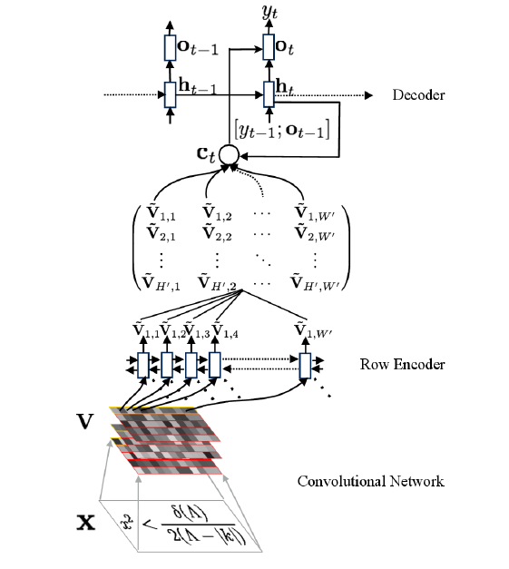

# Image2LaTex

**Список участников:**

Горбенко Даниил, Евсикова Дарья, Праздничных Антон

**Краткое описание задачи:**

Цель данного проекта - обобщить знания о задаче преобразования изображения математической формулы в LaTex код. Это подразумевает выделение существующих архитектур моделей для данной задачи и их различных модификаций. Идея такая, что в разных статьях есть разные модификации, часто не зависящие от конкретной архитектуры, которые могут значительно влиять на перфоманс конкретной модели. Было бы интересно применить эти модификации к разным моделям, исследовать их влияние на результаты и, таким образом, определить лучшую комбинацию. Также мы хотим исследовать влияние различных параметров, связанных непосредственно с обучением (различные методы оптимизации, расписания learning rate, размеры батча, регуляризации, инициализации, разные модификации функции потерь). 

**Данные:**

Набор данных IM2LATEX-100K содержит ~103 тыс. различных математических уравнений в LaTeX формате вместе с соответствующими изображениями формул. Формулы (количество символов в которых находится в диапазоне от 40 до 1024) были получены из LaTeX исходников различных статей. Файлы PDF с формулой были преобразованы в формат PNG. Итоговый набор данных содержит ~103k изображений с разрешением 1654×2339 и соответствующие формулы LaTeX. Набор данных разделен на обучающую выборку (~84 тыс. уравнений), валидационную выборку (~9 тыс. уравнений) и тестовую выборку (~10 тыс. уравнений).


<!-- Neural Model converting Image to Latex.



As the picture shows, given an input image, a CNN and RNN encoder is applied to extract visual features firstly. And then the encoded features are used by an RNN decoder with attention mechanism to produce final formulas.


## Install Prerequsites

```
pip3 install -r requirements.txt
```


## Quick Start

We provide a small preprocessed dataset (`./sample_data/`) to check the pipeline. To train and evaluate model in this sample dataset:

```shell
python3 train.py
```


##  Train on full dataset

Download the [prebuilt dataset from Harvard](https://zenodo.org/record/56198#.V2p0KTXT6eA) and use their preprocessing scripts found [here](https://github.com/harvardnlp/im2markup).

After that, to train and evaluate model on full dataset, you can just pass the full dataset path to `train.py`:

```shel
python3 train.py --data_path=FULL_DATASET_PATH
``` -->

## Links

* [What You Get Is What You See:A Visual Markup Decompiler](https://arxiv.org/pdf/1609.04938v1.pdf)

* [Image to Latex](http://cs231n.stanford.edu/reports/2017/pdfs/815.pdf)

* [Image To Latex with DenseNet Encoder and Joint Attention](https://www.sciencedirect.com/science/article/pii/S1877050919302686/pdf?md5=28f37e951b6f27a28b3ebb1879d5ed94&pid=1-s2.0-S1877050919302686-main.pdf)
